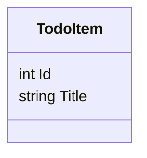

# todo-app-angular-dotnet

A full-stack TODO list application built with **Angular 20** and **.NET 9 Web API**.

## Features

This application implements the core features of a basic TODO management system:

- View all TODO items (loaded by default)
- Add a new TODO item via form
- Delete an existing TODO item

---

## Tech Stack

| Layer     | Technology               | Version           |
|-----------|--------------------------|-------------------|
| Frontend  | Angular                  | `20.x` (May 2025) |
| Backend   | ASP.NET Core Web API     | `9.0.x` (STS)     |

> **Note**: .NET 9 is a Short-Term Support (STS) release.  
> For long-term production use, consider .NET 8 LTS.

---

## Data Model



---

## Development Environment

To ensure consistent builds across all developers, this project **locks the environment** via:

| Tool         | Version Source  | Notes                                     |
|--------------|------------------|-------------------------------------------|
| Node.js      | `.nvmrc`         | Version `20.17.0`                         |
| .NET SDK     | `global.json`    | Version `9.0.200`                         |
| nvm (optional) | —              | Use [nvm](https://github.com/nvm-sh/nvm) or nvm-windows |

---

## Quick Start

```bash
# Use correct Node version (if nvm is installed)
nvm use || true

# One-click setup (installs frontend & backend deps)
chmod +x scripts/bootstrap.sh
./scripts/bootstrap.sh
```

---

## How to Run

### Frontend (Angular)

```bash
cd client
npm start
```

### Backend (.NET)

```bash
cd server
dotnet run
```

## Run with Docker

This project also provides a containerized setup for consistent builds across any machine.

### Requirements
- Docker
- Docker Compose v2+

### Start the stack

```bash
docker compose up --build
```

### Services
- **API (.NET)** → http://localhost:5264/api/todo
- **Web (Angular)** → http://localhost:8080

### Stop the stack

```bash
docker compose down
```

---

## Tests & Coverage

| Layer     | Command                                                                 |
|-----------|-------------------------------------------------------------------------|
| Frontend  | `cd client && npm test -- --watch=false` |
| Backend   | `dotnet test` |

---

## Pre-commit Hooks

This project uses **Husky + lint-staged + dotnet format** for code consistency.

| Area     | Tool                         | Behavior                     |
|----------|------------------------------|------------------------------|
| Frontend | `prettier --check`           | Checks formatting only       |
| Backend  | `dotnet format --verify-no-changes` | Checks code format compliance |

### Manual Fix Commands

```bash
# Frontend (Prettier fix)
npm --prefix client exec prettier -- --write <file>

# Backend (.NET format)
cd server
dotnet format
```

---

## Conventions

- **Line endings**: LF enforced via `.gitattributes`
- **Code style**: Enforced via `.editorconfig`
- **Commit strategy**: All PRs must pass CI and pre-commit checks
- **Git branches**: Follow GitHub Flow or your team policy

---

## One-time Commit to Lock Dev Environment

```bash
mkdir -p scripts

# After adding files below:
# .nvmrc, global.json, .editorconfig, .gitattributes, scripts/bootstrap.sh, README.md

git add .nvmrc global.json .editorconfig .gitattributes scripts/bootstrap.sh README.md
git commit -m "chore: lock dev env & add bootstrap + README"
git push origin main
```